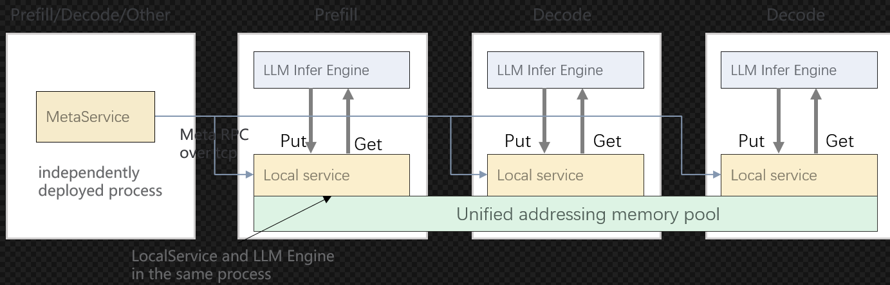
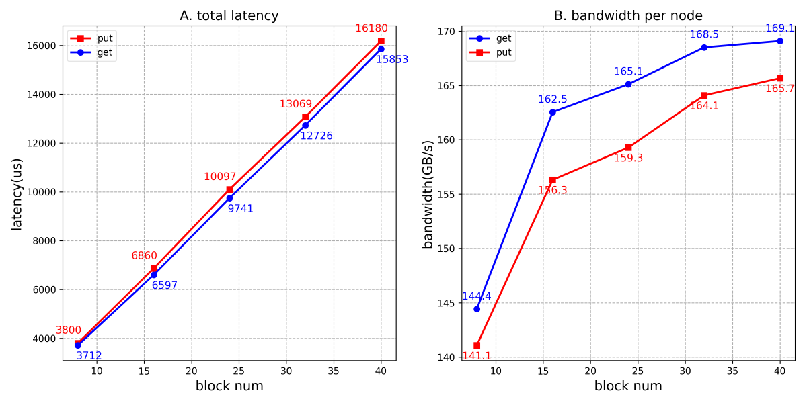
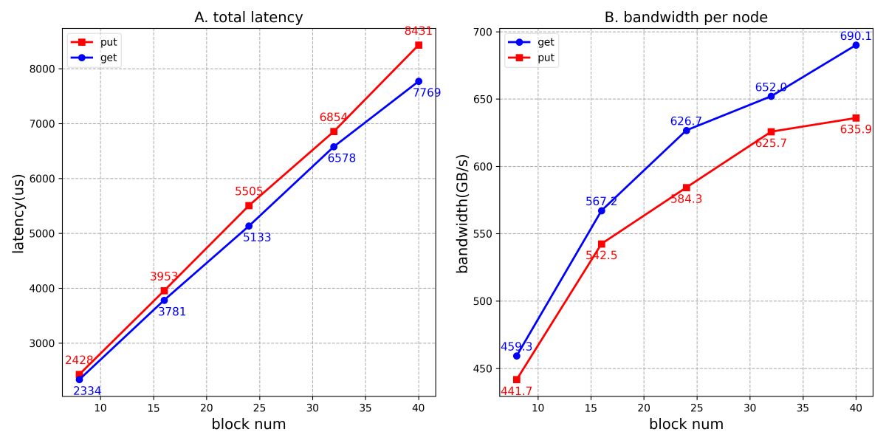

# MemCache

## 🔄Latest News

- [2025/12] MemCache已作为vllm-ascend backend使能大模型推理加速，详情查看vllm-ascend开源社区，相关pr: https://github.com/vllm-project/vllm-ascend/pull/4438

- [2025/11] MemCache项目于2025年11月开源，开源社区地址为：https://gitcode.com/Ascend/memcache

## 🎉概述

MemCache是针对LLM推理、GR推理场景设计的高性能分布式KVCache存储引擎，其主要特性包括：

- **基于对象操作的API**：支持批量和非批量的put/get/exist/remove操作，支持多层结构的KV Block读写接口。
- **支持多副本**：单个对象支持多副本放置到不同的LocalService，默认是单副本，支持put接口指定副本数量。
- **高带宽低时延**：使用 [MemFabric](https://gitcode.com/Ascend/memfabric_hybrid)
  作为多级内存和异构网络传输的底座，在Ascend硬件上，基于device_rdma(A2)、device_sdma(A3)、host_rdma(A2/A3)
  等路径提供OneCopy跨机跨介质数据直接访问能力，满足高带宽，低时延的读写性能述求。在鲲鹏硬件上，支持host_urma(K5)。
- **支持扩缩容**：支持LocalService动态加入和移除
- **HA能力**：在K8S集群中，MetaService支持多活能力，支持元数据恢复，提供尽力而为的HA能力。
<div align="center">
  
</div>

## 🧩核心组件

MemCache包含LocalService和MetaService两大核心组件：

- **MetaService**：
  - 负责管理整个集群中内存池空间的分配和管理，处理LocalService的加入与退出。
  - MetaService作为独立进程运行，提供两种启动方式：python API启动；二进制启动，详见 [安装部署](./doc/build.md)
  - MetaService支持两种部署形态：
  ***1、单点模式***：MetaService由单个进程组成，部署方式简单，但存在单点故障的问题。如果MetaService进程崩溃或无法访问，系统将无法继续提供服务，直至重新恢复为止。
  ***2、HA模式***：该模式基于K8S的的ClusterIP Service和Lease资源构建，部署较为复杂，该模式会部署多个MetaService进程实例，实现多活高可用。部署详见 [MetaService HA](./doc/memcache_metaservice_HA.md)      
                

- **LocalService**：负责承担如下功能：
  - **客户端**：作为客户端，以whl/so形式作为共享库被应用进程加载调用API
  - **内存提供者**：负责提供一段连续的内存区域作为内存池空间的一部分，其内存可以被其他LocalService实例基于地址直接访问。


## 🔥性能表现

MemCache核心能力是提供大容量内存池和高性能的H2D、D2H、**D2RH、RH2D**数据访问能力，由于MemCache以 [MemFabric](https://gitcode.com/Ascend/memfabric_hybrid) 作为池化底座，所以支持RH2D、D2RH等OneCopy跨机跨介质数据直接访问能力，下图为RH2D对比其他中转路径的对比示意图。
<div align="center">
  
</div>

基于OneCopy跨机跨介质数据直接访问的能力，MemCache在A2/A3做了相关性能测试如下：
模拟构造DeepSeek-R1模型KV大小的block，单个block size为：61x128K + 61x16K = 8784KB ≈ 8.57MB，共122个离散地址。

- 使用2个昇腾A2节点(每节点8张卡)组成双机内存池进行读写测试性能如下：
<div align="center">
  
</div>

- 使用2个昇腾A3节点(每节点8张卡16Die)组成双机内存池进行读写测试性能如下：
<div align="center">
  
</div>

## 🔍目录结构

```
├── LICENSE                                 # LICENSE
├── .clang-format                           # 格式化配置
├── .gitmodules                             # git配置
├── .gitignore                              # git忽视配置文件
├── CMakeLists.txt                          # 项目的CMakeList
├── doc                                     # 文档目录
├── example                                 # 样例
│  ├── cpp                                  # c++样例
│  └── python                               # python样例
├── script                                  # 构建脚本
│  ├── build_and_pack_run.sh                # 编译+打包脚本
│  ├── build.sh                             # 编译脚本
│  ├── run_ut.sh                            # 编译+运行ut脚本
├── test                                    # test目录
│  ├── python                               # python测试用例
│  ├── k8s_deploy                           # k8s ha样例脚本
│  ├── fuzz                                 # fuzz目录
│  └── ut                                   # 单元测试用例
├── src                                     # 源码
│  ├── memcache                             # MemCache 源码
├── config                                  # 配置目录
│  ├── mmc-local.conf                       # 本地服务配置文件模板
│  ├── mmc-meta.conf                        # meta服务配置文件模板
├── README.md
```

## 🔜 Incoming Features

➡️支持中

-  MetaService支持基于restful进行集群管理、数据查询、指标查询，支持对接prometheus和grafana
-  HBM + DRAM + SSD 三级内存池

✅已支持
- DRAM 内存池
- HBM + DRAM两级内存池
- MetaService 高可用
- LocalService 动态扩缩容

## 🚀快速入门

请访问以下文档获取简易教程。

- [编译部署](./doc/build.md)：介绍组件编译和安装教程。
- [配置文件](doc/memcache_config.md)：涉及MetaService、LocalService公共配置
- [样例执行](./example/examples.md)：介绍如何端到端执行样例代码，包括C++和Python样例。
- [最佳实践]：推出中...
## 📑学习教程

- [c++接口](doc/mamcache_c++_api.md)：C++接口介绍以及C++接口对应的API列表
- [python接口](doc/memcache_python_api.md)：python接口介绍以及python接口对应的API列表

## 📦软件硬件配套说明

- MemCache软件依赖 [MemFabric](https://gitcode.com/Ascend/memfabric_hybrid)，相关配套与MemFabric相同

## 📝相关信息

- [安全声明](./doc/SECURITYNOTE.md)

- [许可证](./LICENSE)